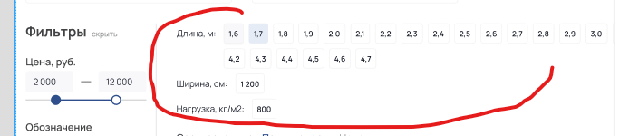

ОТКЛЮЧИТЬ ПЛАГИН cache_delete!!!

- Исправить картинку на мобиле в pop-cat убрать паддинги
- переделать js всех модулей all.js
- как пользоваться поиском на мобиле?
- сделать ленивую загрузку и зазамбить картинки
- Поставить ссылки на политику конфиденциальности
- рзобраться с хедером где адрес, чет все по пязде едет если адрес разных размеров
- лези лоад на карту
- на категориях добавить логику вывода СЕО-выборок 
- вынести крестик в has-icon
- Перенести кнопки купли в прайсе товара в первый столбец
- на телефоны поставить маску
- на статичные сыслки, генерировать через поиск по шаблону
- SVG иконки. Нельзя менять fill при текущем подходе, поэтому нагромождение SVG файлов из-за цветов
- Кол-во в корзине кэшируется в карточке товара, и выводятся старые данные. Сейчас пришлось отключить кэш при вызове любых карточек с корзиной
- Вынести в класс тень для блоков
- Вынести в отдельный класс page-container, разные варианты контейнеров
- Реквизиты в JSOn.
- Жстко отрефакторить core\elements\modules\mobile-menu\snippets\data.php
- ЖЕстко отрефакторить fast-search
  - Не нравится событие на закрытие
  - Сам ajax.php ужасен
  - JS тоже нужно смотреть
- Все выводы каталогов и дочерних элементов (категорий) получать из modules/map-resources/mapResources.php как какталог в меню